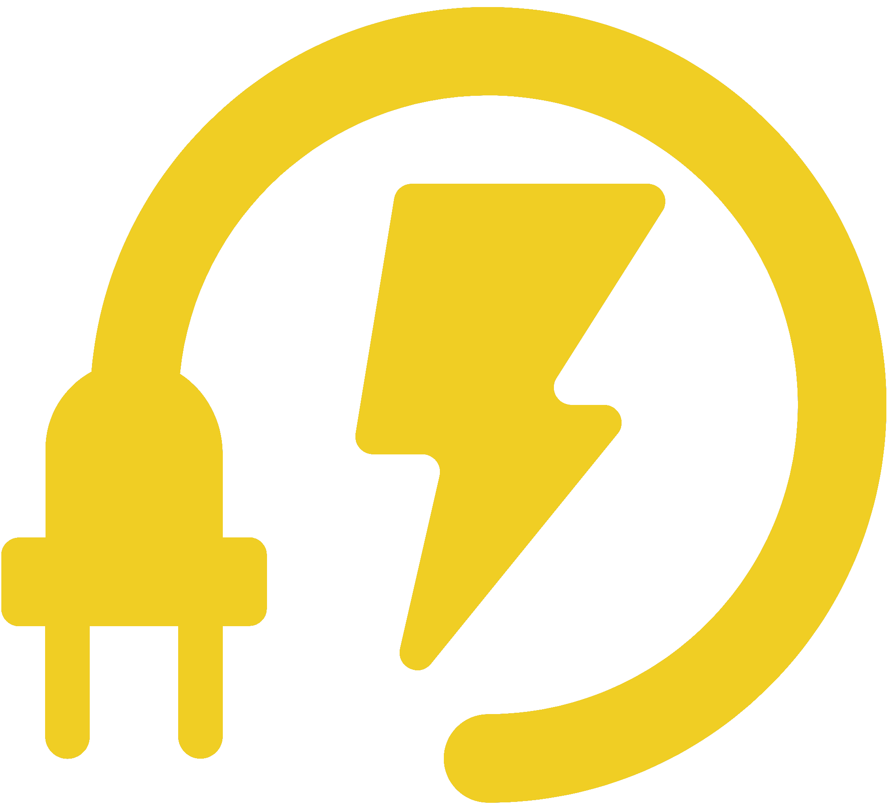

# LNK

A link shortener

## Setup

With current versions of Node.js and git installed:

```
git clone git@github.com:sirberus/LNK.git
npm i
npm run start
```

Then go to `localhost:3030` ⚡️

## About

I built this in a night as a coding challenge! It's a full-stack application entirely in Node.js for ease of installation.

> ⚠️ **Warning: Wall of Text**<br>
> *For the sake of the coding challenge and for anyone who might read this in the future, __I am being much more verbose in this readme than normal__.*

### Application Architecture

The backend was built using [feathers](https://feathersjs.com/), a node server framework built on top of [express](https://expressjs.com/). I chose feathers because it's excellent for prototyping so I can get going quickly, it scales very nicely, and it has adapters for many different databases. For now we can use [NeDB](https://github.com/louischatriot/nedb) so that the full site is npm installable, minimizing setup. If needed, however, we could swap out the DB adapter for Mongo or Postgres without any refactoring of the application logic. Lastly, feathers has a wonderful CLI tool that makes it trivial to spin up working backends in seconds, *with unit tests ready to go*. 👨‍🔬

The frontend was built with [Vue](https://vuejs.org). The coding challenge indicated that the frontend could be very simple, but I felt that wasn't enough. I'm very product-minded and it was important to me to have an aesthetic and functional frontend. Also I adore Vue and will write it any chance I get! I also put in some extra effort to make a logo, choose a palette, and more. Jump to the **"Sugar on Top"** section at the bottom to see more extras I added in. 🎁

Finally, I'm not happy without doing some branding and polish:
- I chose the name LNK on purpose to go with URL
- I chose the color scheme carefully
- I added copy-to-clipboard including an svg logo I sought out
- I chose a logo, colored it, and converted it to a favicon for use on the site and in urls

All in all it's very complete - not bad for a night's work! 👌

---

### Creating the Backend

1) Install the [Feathers CLI tool](https://github.com/feathersjs/cli) with `npm i -g @feathersjs/cli`

2) Scaffold an app with `feathers generate app`

3) Scaffold an endpoint with `feathers generate service`. I named mine `links`. We only need a REST endpoint so I intentionally omitted websockets.

4) Scaffold a hook with `feathers generate hook`

5) Create the hook and wire it up

- check if a link has been shortened already, 
  - if so return the extant one instead
  - otherwise give it a special id to use for the short URL. I called mine `LNK`.
  - Make sure the LNK can work in a URL (I  used [base64url](https://www.npmjs.com/package/base64url) to ensure this)

6) Wire in the hook.

7) Create an express endpoint to handle looking up LNKs and redirecting. I put mine on `/L` to keep it all short.

### Creating the Frontend

1) Get the [Vue CLI](https://cli.vuejs.org/) with `npm i -g @vue/cli`

2) Scaffold a Vue application with `vue create foo` where foo is the name of the Vue app. I called mine `frontend` and I only used Babel in the CLI options.

3) Add [Tailwind CSS](https://tailwindcss.com/) from CDN link. I like Tailwind because it's just utility classes so your end result is truly custom.

4) Wire in the [feathers REST client](https://docs.feathersjs.com/api/client/rest.html)` pointed at localhost:3030 for now (feathers server default host:port)

5) Create a simple form to handle user input, wired into the feathers client

7) Display response data and make the new URL clickable

8) Add a way to reset the form.

9) Build for production.

10) Have the server serve up the built frontend on `/` - not the whole app is just one process 😎
